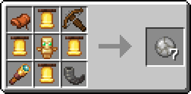

# Shattered Orb of Origin

The Shattered Orb of Origin can be consumed to randomize your origin with a 5 second cooldown.

### Obtaining

The Shattered Orb of Origin can be crafted in the following ways:

